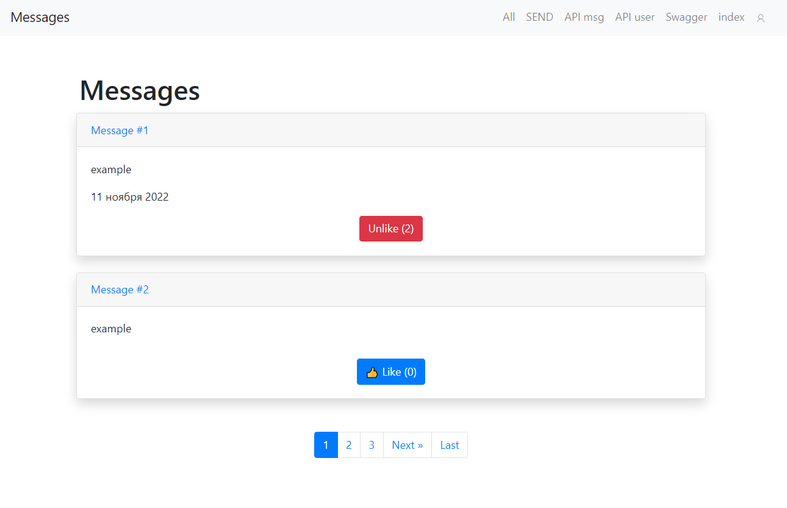
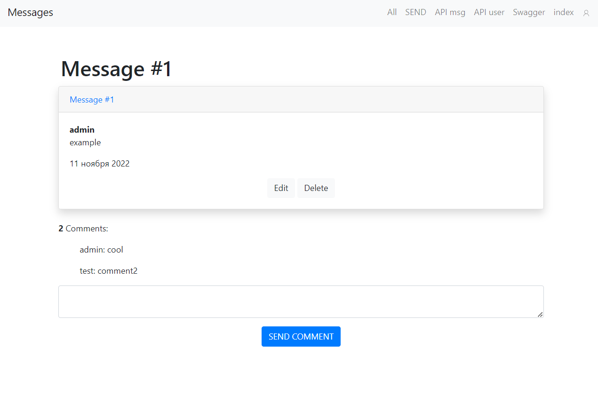
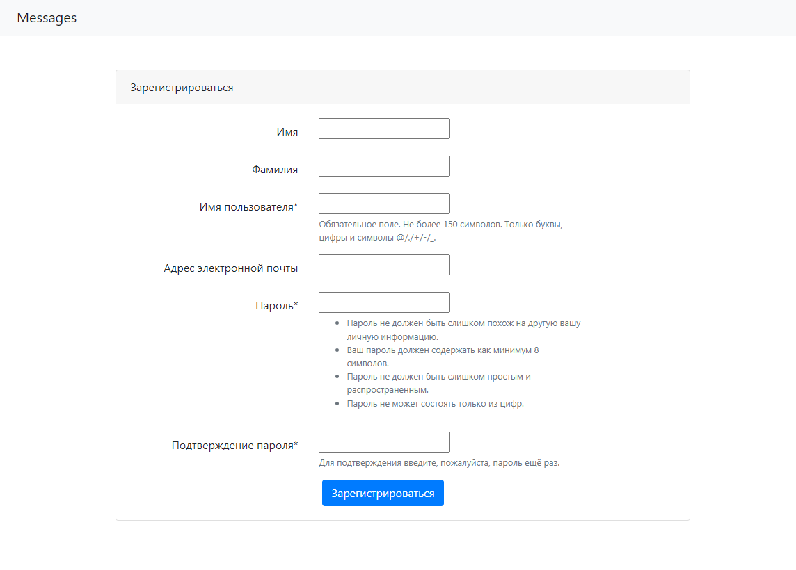
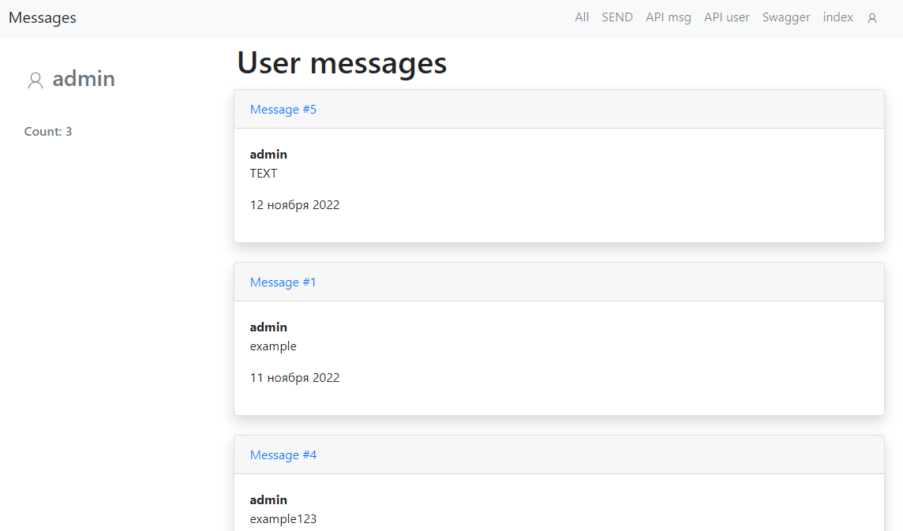
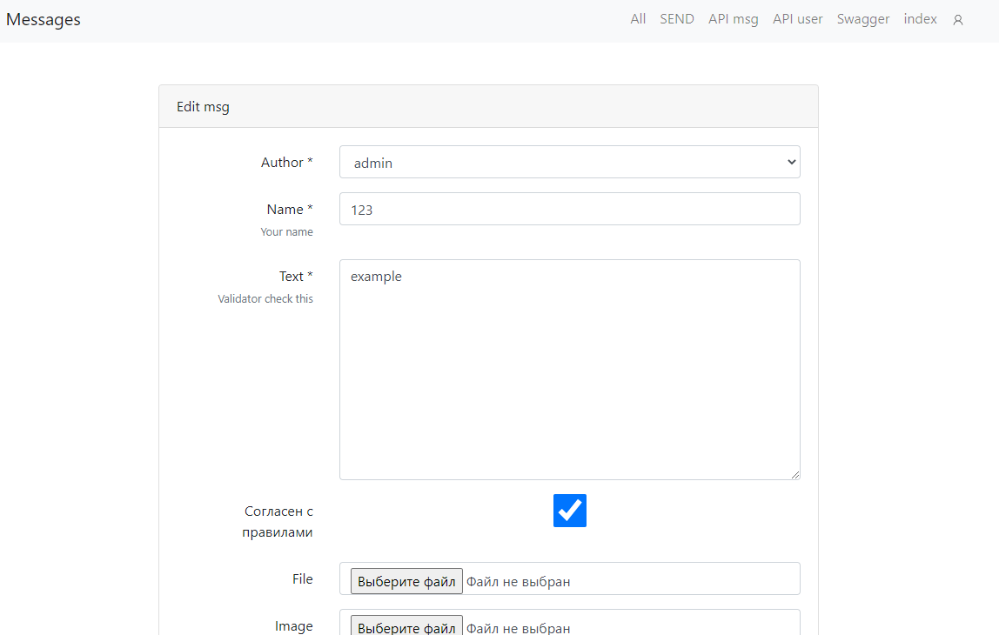
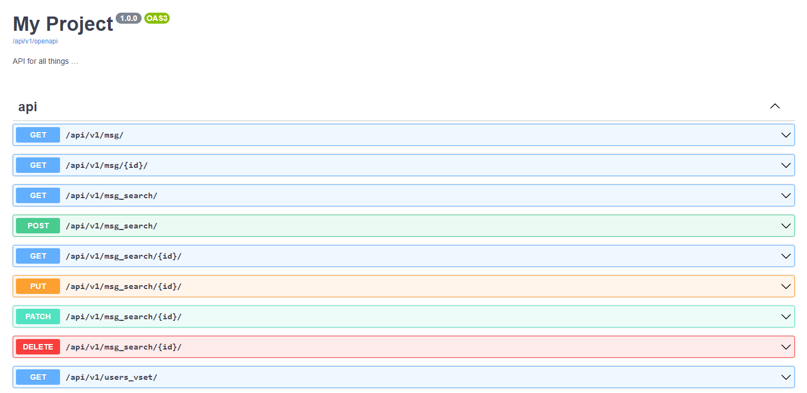

#  Django сборщик форм + API
#### Проект для реализации сбора и обработки форм
Стэк:
**Django+DRF+Bootstrap**

## Основные функции:
* Добавление данных из формы
* Просмотр всех сообщений
* Фильтры поиска в REST API
* CBV
* Шаблоны, Bootstrap
* Страница регистрации и логина
* DRF REST API
* Github Auth
* Unit тесты
* Swagger

## Как запустить
- Создать .env файл
- chmod +x ./entrypoint.sh 
- docker-compose -f up -d --build
- docker-compose -f exec web python manage.py migrate --noinput
- docker-compose -f exec web python manage.py collectstatic --no-input --clear 

## Главная

## Страница с комментариями

## Страница входа
## http://127.0.0.1:8000/signup/

## Страница пользователя

## Форма редактирования

## DRF endpoints
### http://127.0.0.1:8000/api/v1/msg/
### http://127.0.0.1:8000/api/v1/users_vset
### http://127.0.0.1:8000/api/v1/users_vset/1/

## Swagger 
### http://127.0.0.1:8000/api/v1/swagger

